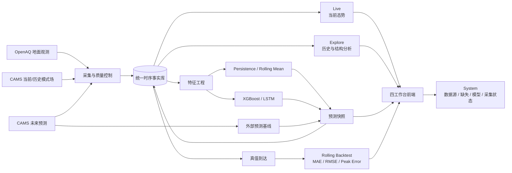
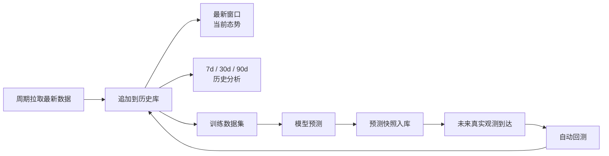

# Air Observatory Architecture

Air Observatory 不是“调 API 做几张图”，而是一条持续运行的数据闭环：

**真实观测 / 模式数据进入系统 → 持续存储 → 历史分析 → 预测 → 真值到达后回测 → 前端实时刷新。**

## 产品闭环



这张图就是整个选题的核心：**现在发生什么、过去为什么这样、未来会怎样、预测到底准不准**，四个问题由同一套持续更新的数据链回答。

## 四个工作台

| 工作台 | 回答的问题 | 主要内容 |
| --- | --- | --- |
| **Live** | 现在发生什么？ | 全国 CAMS 空间场、城市 OpenAQ 实测、数据新鲜度、过去→NOW→未来 |
| **Explore** | 过去有什么规律？ | 实测与模式对照、时间趋势、误差统计；后续扩展 PCA / 聚类 / 气象关系 |
| **Forecast** | 未来会怎样？ | CAMS、Persistence、Rolling Mean；后续加入 XGBoost / LSTM，并统一回测 |
| **System** | 这些结果凭什么可信？ | Provider health、站点绑定、缺失情况、采集运行、模型与评估状态 |

## 数据为什么既“实时”又“可分析”



系统**不会为了“实时”丢掉历史数据**。最新数据不断追加，前端查询不同时间窗口；因此同一套数据既能驱动实时可视化，也能支持统计分析、PCA、机器学习和时间序列预测。

## 工程数据流

```text
OpenAQ / Open-Meteo
        │
        ▼
providers
        │
        ▼
pipelines + worker
        │
        ▼
SQLite WAL
        │
        ▼
repository → services → FastAPI
                         │
                         ▼
                OpenAPI typed client
                         │
                         ▼
              Vue + Vue Query + ECharts
```

关键边界：

- **providers**：外部 API、重试、分页、原始 provider 语义。
- **pipelines**：采集、站点绑定、质量控制、幂等入库。
- **repository**：SQL 统一入口。
- **services**：freshness、数据对齐、业务语义和模型评估。
- **FastAPI**：只提供稳定数据接口，不在 Web 进程里偷偷跑采集任务。
- **worker**：独立执行 OpenAQ / CAMS 刷新与预测基线。
- **frontend**：只消费后端真实状态，不维护第二套业务数据。

## 数据语义

- `air_observations`：OpenAQ 地面/传感器观测。
- `air_model_analysis`：CAMS 模式分析场。
- `forecasts`：CAMS 外部预测与本项目模型预测。
- `provider_bindings`：城市与 OpenAQ 外部站点的稳定绑定。
- `ingestion_runs`：每次采集的状态、延迟、错误与最新源时间。

**Observation、Model Analysis、Forecast 永远不混成一种数据。**

## 当前实现边界

已经实现：OpenAQ + CAMS 采集、历史持久化、四工作台、模式/观测对照、Persistence / Rolling Mean、预测快照、训练 readiness、系统状态与真实前后端联动。

下一阶段重点不是继续堆页面，而是补齐 **气象特征 → PCA / 聚类 → XGBoost / LSTM → rolling backtest**，让分析和预测层真正形成完整闭环。
