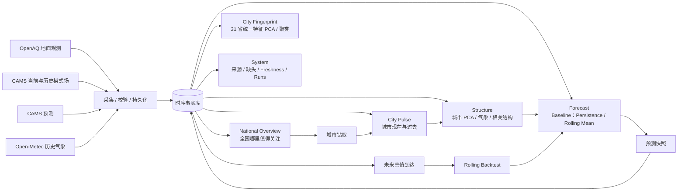
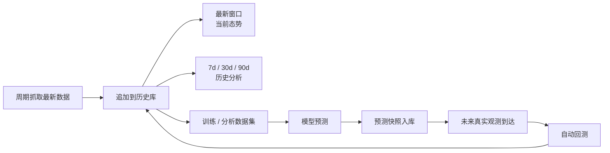

# Air Observatory Architecture

Air Observatory 的核心不是“API + 图表”，而是一条持续运行的数据闭环：



因此产品回答四个连续问题：

**全国哪里异常 → 这个城市发生了什么 → 数据结构为什么这样 → 接下来怎样且预测是否可靠。**

## 产品层级

```text
/overview
   全国模式场
   ├─ 污染等级序列
   ├─ 区域剖面
   ├─ AQI 等级结构
   ├─ 24h 变化
   └─ 31 省结构指纹 PCA / 探索性聚类
        │
        ▼
/city/:locationId
   城市详情
   ├─ Pulse：六污染物历史 + 小时×日期热力 + 历史→NOW→预测
   ├─ Structure：污染物×气象 PCA / 载荷 / 状态空间 / 相关矩阵
   ├─ Forecast：未来路径 + horizon 回测 + 预测×真值
   └─ Trust：覆盖率 / Provider 绑定 / 分析产物

/system
   Provider / Binding / Ingestion / Storage
```

CAMS 覆盖 60 个稳定城市引用点，提供完整空间比较；OpenAQ 只在确有可用地面数据的城市标记真值覆盖。二者不会为了“全国都有实测”的视觉完整性而混合。

**全国层以省为单位阅读。** 60 城读数在东部挤成一团，因此全国页每条读数都归约到 31 个省代表——每省取该省当前 AQI 最高的城市。归约只有一处实现（`frontend/src/lib/provinces.ts`），页面装配层算一次再分发给色带、地图与分析层，所以标题里的省数、色带格数、地图点数、矩阵点数永远描述同一个集合。全部 60 城仍通过分析层的表格孪生可达。

## 数据为什么既实时又能分析



实时不是“动态图动画”，而是**新数据进入系统后，数据库状态和前端读图随之变化**；旧数据保留，因此同一条数据链同时服务实时态势、历史可视化、PCA、机器学习和回测。

## 工程边界

```text
OpenAQ / Open-Meteo
        │
        ▼
providers
        │
        ▼
pipelines + worker
        │
        ▼
SQLite WAL
        │
        ▼
repository → services → FastAPI
                         │
                         ▼
                OpenAPI typed client
                         │
                         ▼
              Vue + Vue Query + ECharts
```

- `providers`：外部 API、重试、分页与原始 provider 语义。
- `pipelines`：采集、站点绑定、幂等写入和 ingestion run。
- `repository`：SQL 统一入口。
- `services`：freshness、数据对齐、AQI 语义和模型评估。
- FastAPI 只提供稳定接口；周期采集由独立 worker 执行。
- 前端只消费后端真实状态，不保存第二套业务数据。

## 数据语义

- `air_observations`：OpenAQ 地面/传感器观测。
- `air_model_analysis`：CAMS 模式分析场。
- `weather_observations`：Open-Meteo 网格化历史气象/再分析特征，明确不冒充站点观测。
- `forecasts`：CAMS 外部预测与本项目模型预测。
- `analysis_runs`：城市 PCA、60 城结构指纹等离线物化分析产物。
- `provider_bindings`：城市与 OpenAQ 站点绑定。
- `ingestion_runs`：每次采集的结果、延迟、错误与源时间。

中国 AQI 当前按 **HJ 633-2026** 实时规则计算。全国页由 CAMS 模式浓度换算，因此界面固定标注“模式浓度换算，非地面监测值”。

## 当前边界

已实现：60 城 CAMS 当前模式场与 90 天统一历史窗、OpenAQ 真值标记、Open-Meteo 网格气象、国家→城市钻取、历史持久化、HJ 633-2026 健康指引、基线预测与回测、城市级离线 PCA，以及基于 21 个统一城市摘要特征的 31 省结构指纹 PCA / 探索性聚类。所有分析先离线物化，HTTP 只读取产物。

下一层：**以真实 OpenAQ PM2.5 为监督目标，在真值覆盖足够的城市做 XGBoost / LSTM，并进入 rolling backtest；真值不足的城市继续只展示 CAMS 预测，不伪装成本项目模型。**
